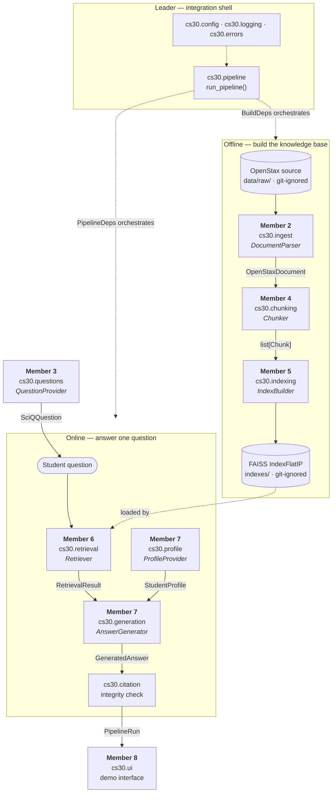
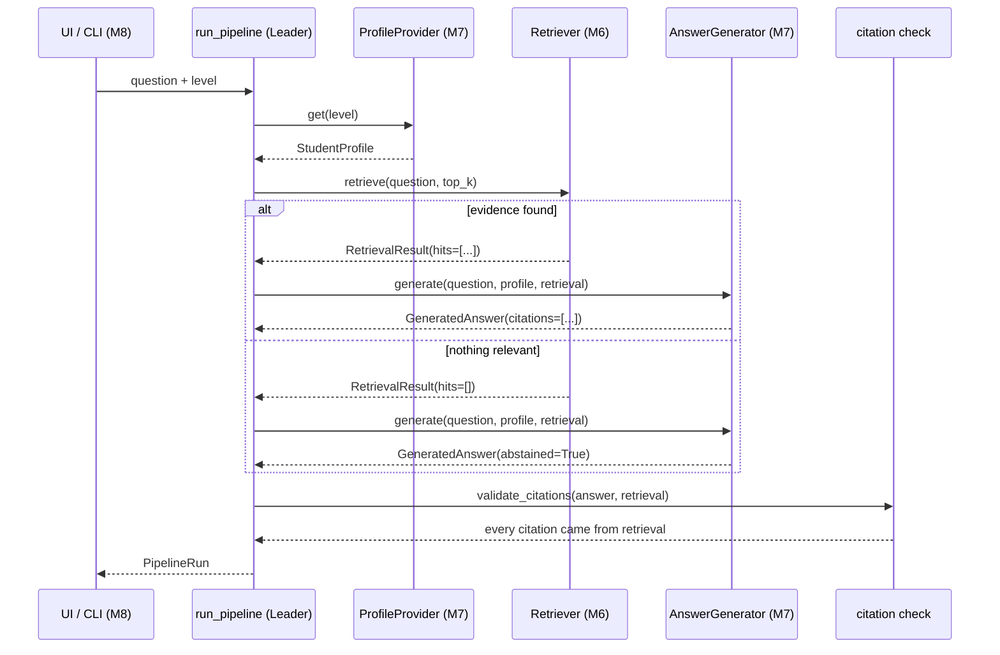

# Week 1 architecture: components, data flow, and call path

Scope: the `v0.1-thin-slice` engineering path only. The semester-long design
(hybrid retrieval, evidence roles, restricted KG, the full evaluation layer)
lives in `docs/系统架构与文献映射.md` and is deliberately **not** shown here.

## 1. Components and ownership

Every box is one member's module. Cross-module payloads are frozen contracts
from `src/cs30/contracts`; computational boundaries are Protocols in
`src/cs30/ports.py`. The UI consumes `PipelineRun` directly.



## 2. Data flow with contract types

| Stage | Producer | Payload | Consumer |
|---|---|---|---|
| Parse | Member 2 | `OpenStaxDocument` | Member 4 |
| Chunk | Member 4 | `list[Chunk]` | Member 5, Member 6 |
| Index | Member 5 | `IndexArtifact` → FAISS index + `chunk_id` map | Member 6 |
| Question | Member 3 | `SciQQuestion` | Members 6, 7 |
| Retrieve | Member 6 | `RetrievalResult` | Member 7 |
| Profile | Member 7 | `StudentProfile` | Member 7 |
| Generate | Member 7 | `GeneratedAnswer` | citation check, UI |
| Run | Leader | `PipelineRun` | Member 8, ablation table |

The character-span convention that ties `Chunk` back to `OpenStaxDocument` is
specified in [interfaces.md](interfaces.md) and enforced by the contract layer.

## 3. End-to-end call path



Two properties this path guarantees, and they are the reason the project exists:

1. **Grounding.** `validate_citations` rejects any answer citing a chunk that
   retrieval did not return. A fabricated source cannot survive the pipeline.
2. **Refusal.** Empty retrieval leads to an abstained answer rather than an
   answer built from unrelated evidence.

## 4. The integration seam

The offline and online paths have separate dependency groups:

- `run_build_pipeline()` uses `BuildDeps` to run parser → chunker → index builder,
  then passes the returned `IndexArtifact` to `Retriever.load_index()`.
- `run_pipeline()` uses `PipelineDeps` for profile → retrieval → generation.

`build_fixture_build_deps()` and `build_fixture_deps()` supply stand-ins. The
configured-provider path is wired through the same frozen interfaces in
`build_real_deps()`. It remains labelled as a fixture run until a real Member 6
retriever and index replace the portable smoke evidence:

```python
def build_real_deps(config: AppConfig) -> PipelineDeps:
    return PipelineDeps(
        mode="fixture",
        profile_provider=Week1ProfileProvider(),
        retriever=CombinedEvidenceRetriever(evidence),
        generator=PersonalisedAnswerGenerator(client),
    )
```

Member 3 works behind `QuestionProvider`; member 8 consumes `PipelineRun`
directly. This keeps module work independent without claiming that the UI is a
computational Protocol implementation. Member 6's later dense retriever can
replace the portable retriever without changing `PipelineDeps` or the contracts.

## 5. What is deliberately absent in week 1

BM25 and RRF, evidence-role annotation, restricted KG, topic resolution,
level-aware reranking, calibrated abstention thresholds, and every retrieval or
answer metric. Week 1 proves the path runs; it proves nothing about quality.
